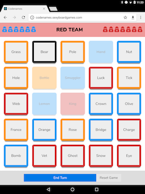
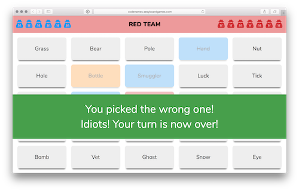

# Codenames 

  

A web based implementation of the board game Codenames. 

**This project is a passion project by fans of the game and is in no way associated with the original game or it's creators.**

It includes [additional rules](./docs/rules.md) for the game including [*drinking*](./docs/rules.md/#drinking-rules) and [*strip*](./docs/rules.md#strip-rules) rules.

## Screenshots

 

## Developing
